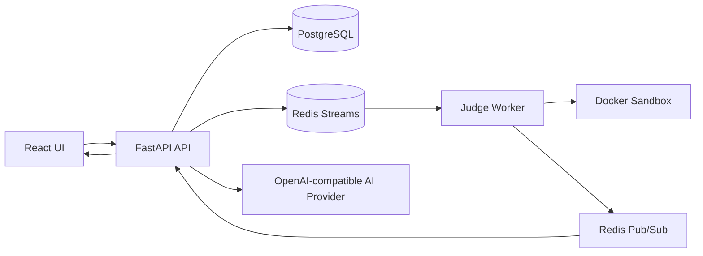

# FastOJ

English | [简体中文](README.zh-CN.md)

FastOJ is an AI-assisted online judge for interview practice. It combines strict
Docker-based judging, a Monaco coding workbench, bilingual product UI, realtime
submission status, and AI explanations that are grounded in public judging
context instead of hidden tests.

If you want a project that feels like a compact LeetCode-style training platform,
but is still hackable enough to run locally, inspect, and extend, FastOJ is built
for that.

## Why Clone It

- **Real OJ behavior, not a toy runner.** Submissions run through a Redis-backed
  judge worker and Docker sandbox. Production code does not fall back to host
  `subprocess` execution.
- **Function mode and ACM mode are both first-class.** Function mode gives
  learners a language-specific starter frame; ACM mode keeps classic stdin/stdout
  practice available for every problem.
- **AI help is useful without leaking hidden cases.** Hints, explanations,
  reviews, and chat use verdicts, user code, public samples, and safe aggregate
  summaries. Hidden testcase input, expected output, and actual output are not
  returned to users or sent to the AI provider.
- **The frontend is a real product surface.** It includes a searchable problem
  library, card/list layouts, a three-column workbench, judge timeline, AI drawer,
  submission trail, local discussion, settings, admin screens, and a training
  graph.
- **It is ready for provider experiments.** The AI layer uses an
  OpenAI-compatible profile, with examples for hosted DeepSeek-style APIs and a
  local Qwen/llama.cpp server.

## Product Tour

1. **Problem library** - search, filter by tag/difficulty, switch between visual
   cards and a dense OJ-style list, and jump into recommended practice.
2. **Workbench** - read the statement, edit in Monaco, run public cases, submit
   for full judging, and watch status move from pending to result.
3. **AI Copilot** - request progressive hints, failed-submission explanations,
   code review, and contextual chat in the active UI language.
4. **Training graph** - browse knowledge nodes and return to the library with the
   corresponding tag filter applied.
5. **Admin console** - manage users and problems, bootstrap official solutions,
   and review AI-generated problem drafts before publishing.

## Page Showcase

| Problem Library | Coding Workbench |
| --- | --- |
|  |  |
| Searchable practice catalog with filters, card/list layouts, mode badges, and training metrics. | Focused coding surface with the statement, starter frame, public-run controls, result area, and AI Copilot in one view. |

| Training Graph | Auth Flow |
| --- | --- |
|  |  |
| Topic map built with React Flow; clicking a node returns to the library with a tag filter applied. | Dedicated login/register screen that keeps account, submissions, drafts, and AI feedback tied together. |

## Quick Start

The Docker Compose path is the fastest way to try the full product.

```bash
git clone https://github.com/snowstorm-lightning/fastoj.git
cd fastoj
cp .env.example .env
docker compose up --build
```

On Windows PowerShell:

```powershell
Copy-Item .env.example .env
docker compose up --build
```

Open:

```text
http://127.0.0.1:8000
```

Seed the bundled problem set:

```bash
docker compose exec api uv run python -m backend.scripts.seed_data
```

Create the first administrator from a trusted shell:

```bash
docker compose exec api uv run python -m backend.scripts.create_admin --username admin --email admin@example.com
```

The admin script prompts for a password without echoing it. For unattended local
automation, set `FASTOJ_ADMIN_PASSWORD` in the trusted execution environment
instead of passing secrets through shell history.

## Local Development

Use this path when you want to run backend and frontend processes directly. Make
sure PostgreSQL and Redis are available, or keep the Compose services running.

Backend:

```bash
uv sync --extra dev
uv run alembic -c backend/alembic.ini upgrade head
uv run uvicorn backend.main:app --reload --host 0.0.0.0 --port 8000
```

Frontend:

```bash
cd frontend
npm install
npm run dev
```

The Vite dev server can call the same-origin API by default. Set
`VITE_API_BASE_URL` only when the API runs on a separate origin.

## AI Configuration

AI is disabled by default, so the core OJ flow works without any model server or
API key.

```bash
AI_PROVIDER=disabled
```

Hosted OpenAI-compatible provider example:

```bash
AI_PROVIDER=openai_compatible
AI_BASE_URL=https://api.deepseek.com
AI_API_KEY=your-provider-key
AI_MODEL=deepseek-v4-flash
```

Named profiles used by the in-page model selector:

```bash
AI_DEEPSEEK_BASE_URL=https://api.deepseek.com
AI_DEEPSEEK_API_KEY=your-provider-key
AI_DEEPSEEK_MODEL=deepseek-v4-flash

AI_QWEN_BASE_URL=http://host.docker.internal:8080/v1
AI_QWEN_API_KEY=sk-no-key-required
AI_QWEN_MODEL=qwen2.5-coder-7b-instruct-q4_k_m
```

Real secrets belong in `.env` or deployment environment variables. The repository
ignores `.env` and `.env.*`; `.env.example` contains safe placeholders only.

## Safety Model

- Hidden testcase input, expected output, and actual output are never included in
  AI prompts.
- Normal users can explain and review only their own submissions; admins can
  access all submissions through server-side role checks.
- Public registration always creates a normal `user`; administrator accounts are
  bootstrapped from a trusted shell or managed by an existing admin.
- Production judging uses Docker sandbox execution. The
  `FASTOJ_ALLOW_UNSAFE_LOCAL_EXECUTION=true` escape hatch is for local
  development only.
- Sandbox containers run with network disabled, memory limits, pid limits,
  dropped capabilities, `no-new-privileges`, non-root execution, output
  truncation, timeout kill, and cleanup.

## Seeded Curriculum

The bundled seed data is now large enough for sustained interview practice:

- **Hot 100 interview track:** all 100 canonical Hot 100 problems, using
  original FastOJ statements and deterministic ACM input/output for linked-list,
  tree, design, and multi-answer tasks.
- **Function-mode classics:** Two Sum, Add Two Numbers, Longest Substring
  Without Repeating Characters, and Valid Parentheses include starter frames and
  official Python references.
- **AI/ML algorithm exercises:** Logistic Regression Sigmoid, KNN Majority Vote,
  KMeans One Iteration, Scaled Dot-Product Attention, Softmax Cross Entropy, and
  Attention Mask Apply.

Function mode supports Python, C++, Java, JavaScript, TypeScript, Go, and selected
C wrappers for seeded function tasks. ACM mode remains available for every
problem and language. The judge runtime includes Python `numpy==2.2.6` and CPU
`torch==2.7.1+cpu` for AI algorithm exercises.

## Architecture



Core stack:

- Backend: Python 3.11+, FastAPI, SQLAlchemy 2.0, Pydantic v2, Alembic,
  PostgreSQL, Redis Streams.
- Judge: Docker sandbox worker with async queueing, retries, dead-letter handling,
  and duplicate-task protection.
- Frontend: React, TypeScript, Vite, Tailwind CSS, Monaco Editor, TanStack Query,
  Zustand, Zod, xterm, Shiki, React Flow, Pretext text measurement.
- Tooling: `uv`, `ruff`, `pytest`, `npm`, Docker Compose.

## Project Layout

```text
backend/
  ai/          AI provider config, prompts, response schemas
  api/         FastAPI routes
  core/        settings, database, security, logging
  models/      SQLAlchemy models
  schemas/     Pydantic API schemas
  services/    business logic, judging, function wrappers
  worker/      judge worker
frontend/
  src/
    components/
    lib/
    stores/
    main.tsx
tests/         backend tests
docs/          handoff, acceptance, and audit notes
```

## Quality Gate

Run these before handing off substantial changes:

```bash
uv run ruff check .
uv run pytest
cd frontend && npm run build
cd frontend && npm test
```

When judge, worker, WebSocket, sandbox, or real submission behavior changes, also
run:

```bash
docker compose up --build -d api worker
```

The full manual acceptance checklist lives in
[`docs/ACCEPTANCE_HARNESS.md`](docs/ACCEPTANCE_HARNESS.md).

## Known Limits

- Monaco and Shiki currently ship directly in the frontend bundle, so production
  chunks are large.
- C function-mode wrappers cover only simpler seeded signatures today; use ACM
  mode for C on matrix/string-heavy AI tasks until those wrappers are expanded.
- MLE classification depends on Docker runtime exit behavior.
- AI quality depends on the configured OpenAI-compatible model and prompt
  behavior.
- The initial Alembic migration is a baseline for the current schema and should
  be validated against any existing production database before rollout.
