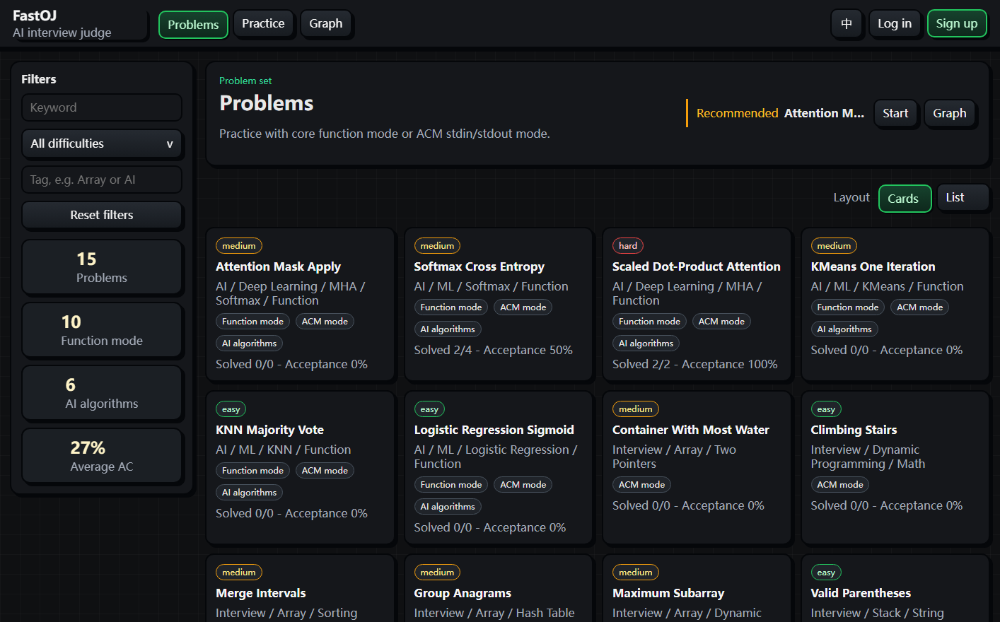
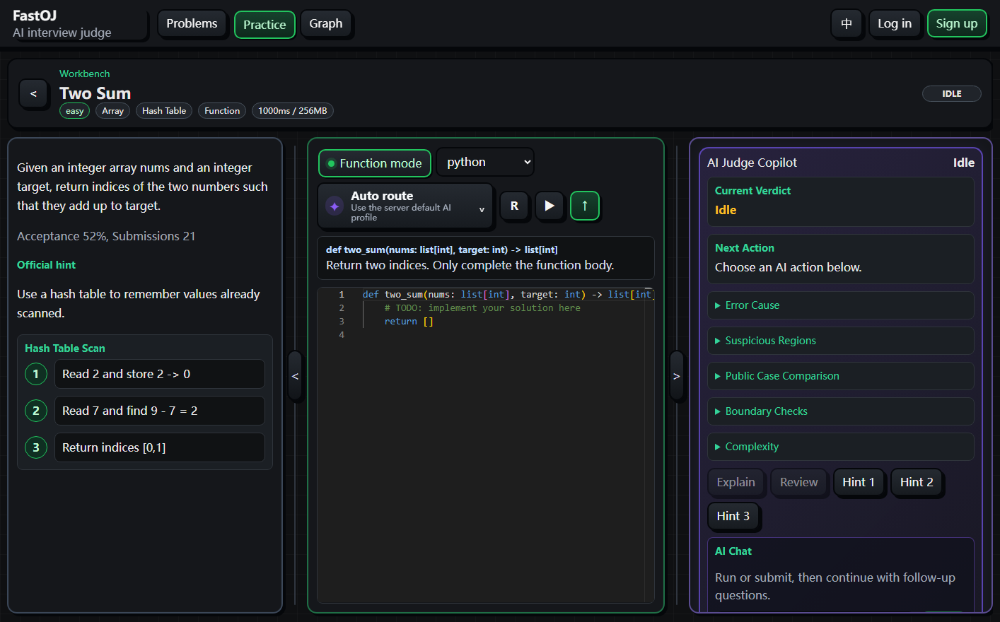
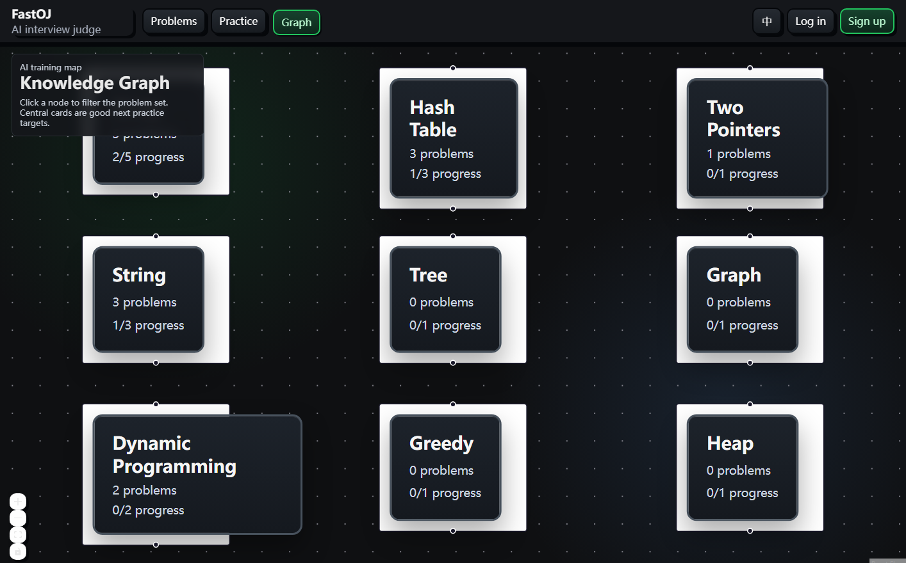
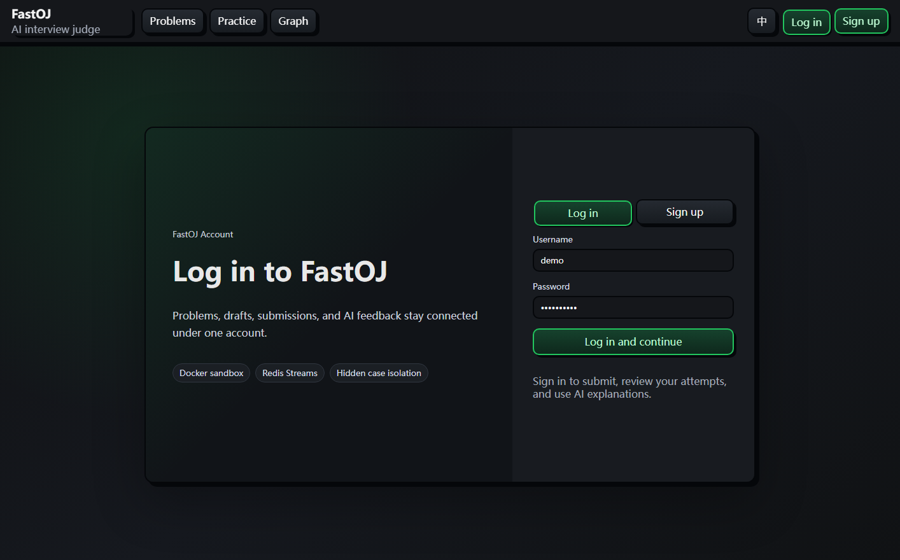
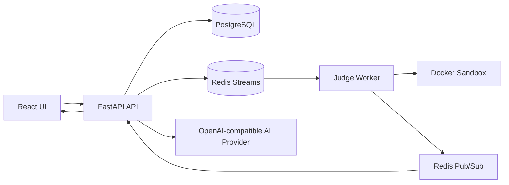

# FastOJ

[English](README.md) | 简体中文

FastOJ 是一个面向面试训练的 AI 辅助在线评测平台。它把 Docker 沙箱判题、
Monaco 编程工作台、双语界面、实时提交状态和安全的 AI 解释整合在一起，让
你可以在本地跑起一套接近 LeetCode 体验、但更容易改造和研究的 OJ 系统。

如果你想下载一个能真实评测代码、能展示完整产品体验、还能安全接入 AI 的
开源项目，FastOJ 值得一试。

## 为什么值得 Clone

- **是真正的 OJ，不是玩具运行器。** 提交通过 Redis 队列进入 Judge Worker，
  再由 Docker 沙箱执行；生产代码不会回退到宿主机 `subprocess`。
- **函数模式和 ACM 模式同等重要。** 函数模式给学习者提供对应语言的 starter
  frame；ACM 模式保留传统 stdin/stdout 训练方式。
- **AI 能帮忙，但不泄露隐藏用例。** 提示、解释、代码审查和对话只使用判题
  结果、用户代码、公开样例和安全的聚合摘要。隐藏用例输入、期望输出、实际
  输出不会返回给用户，也不会发送给 AI 服务商。
- **前端不是演示壳。** 题库、卡片/列表布局、三栏工作台、判题时间线、AI
  侧栏、提交轨迹、本地讨论、设置页、管理后台和知识图谱都已经接入。
- **适合做 AI Provider 实验。** AI 层使用 OpenAI-compatible profile，既能
  接 DeepSeek 风格的托管 API，也能接本地 Qwen/llama.cpp 服务。

## 产品体验

1. **题库页** - 搜索、标签/难度筛选、卡片和传统 OJ 列表切换、推荐练习入口。
2. **编程工作台** - 阅读题面、在 Monaco 中写代码、运行公开样例、提交完整
   判题，并观察状态从 pending 到 result。
3. **AI Copilot** - 按当前界面语言请求渐进提示、失败解释、代码审查和上下文
   对话。
4. **训练图谱** - 浏览知识点节点，点击节点后回到题库并自动应用标签筛选。
5. **管理后台** - 管理用户和题目、补全官方题解、审核 AI 生成的题目草稿后再
   发布。

## 页面展示

以下截图使用英文界面；产品右上角可以切换中文。

| 题库页 | 编程工作台 |
| --- | --- |
|  |  |
| 可搜索的练习目录，支持筛选、卡片/列表布局、模式标签和训练数据概览。 | 集中式刷题界面，把题面、starter frame、公开样例运行、结果区和 AI Copilot 放在同一视图中。 |

| 训练图谱 | 登录注册 |
| --- | --- |
|  |  |
| 基于 React Flow 的知识点地图，点击节点后回到题库并自动应用标签筛选。 | 独立登录/注册页，让账号、提交记录、草稿和 AI 反馈保持关联。 |

## 快速启动

Docker Compose 是最快的完整体验路径。

```bash
git clone https://github.com/snowstorm-lightning/fastoj.git
cd fastoj
cp .env.example .env
docker compose up --build
```

Windows PowerShell：

```powershell
Copy-Item .env.example .env
docker compose up --build
```

打开：

```text
http://127.0.0.1:8000
```

导入内置题库：

```bash
docker compose exec api uv run python -m backend.scripts.seed_data
```

从可信 shell 创建第一个管理员：

```bash
docker compose exec api uv run python -m backend.scripts.create_admin --username admin --email admin@example.com
```

管理员脚本会无回显地提示输入密码。无人值守的本地自动化场景可以在可信执行
环境里设置 `FASTOJ_ADMIN_PASSWORD`，不要把真实密码写进命令历史。

## 本地开发

如果你想直接跑后端和前端进程，可以使用下面的方式。请先确保 PostgreSQL 和
Redis 可用，或者保留 Compose 中的基础服务运行。

后端：

```bash
uv sync --extra dev
uv run alembic -c backend/alembic.ini upgrade head
uv run uvicorn backend.main:app --reload --host 0.0.0.0 --port 8000
```

前端：

```bash
cd frontend
npm install
npm run dev
```

Vite 开发服务器默认可以调用同源 API。只有当前端和 API 分别跑在不同 origin
时，才需要设置 `VITE_API_BASE_URL`。

## AI 配置

AI 默认关闭，所以不配置模型服务或 API Key 也能使用核心 OJ 流程。

```bash
AI_PROVIDER=disabled
```

托管 OpenAI-compatible Provider 示例：

```bash
AI_PROVIDER=openai_compatible
AI_BASE_URL=https://api.deepseek.com
AI_API_KEY=your-provider-key
AI_MODEL=deepseek-v4-flash
```

页面内模型选择器使用的命名 profile：

```bash
AI_DEEPSEEK_BASE_URL=https://api.deepseek.com
AI_DEEPSEEK_API_KEY=your-provider-key
AI_DEEPSEEK_MODEL=deepseek-v4-flash

AI_QWEN_BASE_URL=http://host.docker.internal:8080/v1
AI_QWEN_API_KEY=sk-no-key-required
AI_QWEN_MODEL=qwen2.5-coder-7b-instruct-q4_k_m
```

真实密钥放在 `.env` 或部署环境变量中。仓库已经忽略 `.env` 和 `.env.*`；
`.env.example` 只保留安全占位值。

## 安全模型

- 隐藏用例输入、期望输出、实际输出不会进入 AI prompt。
- 普通用户只能解释和审查自己的提交；管理员访问全部提交也由服务端角色检查
  保护。
- 公开注册只能创建普通 `user`；管理员账号需要从可信 shell 启动，或由已有管
  理员管理。
- 生产判题只使用 Docker 沙箱；`FASTOJ_ALLOW_UNSAFE_LOCAL_EXECUTION=true`
  只允许本地开发使用。
- 沙箱容器默认禁用网络，带内存限制、pid 限制、capability drop、
  `no-new-privileges`、非 root 用户、输出截断、超时终止和清理。

## 内置题库

种子数据足够覆盖完整产品体验：

- **经典函数题：** Two Sum、Add Two Numbers、Longest Substring Without
  Repeating Characters。
- **面试清单 ACM 题：** Valid Parentheses、Maximum Subarray、Group
  Anagrams、Merge Intervals、Climbing Stairs、Container With Most Water。
- **AI/ML 算法题：** Logistic Regression Sigmoid、KNN Majority Vote、
  KMeans One Iteration、Scaled Dot-Product Attention、Softmax Cross
  Entropy、Attention Mask Apply。

函数模式支持 Python、C++、Java、JavaScript、TypeScript、Go，以及部分简单 C
wrapper。所有题目仍然可以使用 ACM 模式。Judge runtime 内置 Python
`numpy==2.2.6` 和 CPU `torch==2.7.1+cpu`，AI 算法题可以使用标准 Python、
NumPy 或 PyTorch。

## 架构



核心技术栈：

- 后端：Python 3.11+、FastAPI、SQLAlchemy 2.0、Pydantic v2、Alembic、
  PostgreSQL、Redis Streams。
- 判题：Docker 沙箱 Worker，支持异步队列、重试、死信队列和重复任务保护。
- 前端：React、TypeScript、Vite、Tailwind CSS、Monaco Editor、TanStack
  Query、Zustand、Zod、xterm、Shiki、React Flow、Pretext 文本测量。
- 工具：`uv`、`ruff`、`pytest`、`npm`、Docker Compose。

## 项目结构

```text
backend/
  ai/          AI provider 配置、prompt、响应 schema
  api/         FastAPI 路由
  core/        设置、数据库、安全、日志
  models/      SQLAlchemy 模型
  schemas/     Pydantic API schema
  services/    业务逻辑、判题、函数模式 wrapper
  worker/      Judge Worker
frontend/
  src/
    components/
    lib/
    stores/
    main.tsx
tests/         后端测试
docs/          交接、验收和审计文档
```

## 质量门槛

较大的变更交付前运行：

```bash
uv run ruff check .
uv run pytest
cd frontend && npm run build
cd frontend && npm test
```

如果改动涉及 judge、worker、WebSocket、沙箱或真实提交链路，还需要运行：

```bash
docker compose up --build -d api worker
```

完整手工验收清单位于
[`docs/ACCEPTANCE_HARNESS.md`](docs/ACCEPTANCE_HARNESS.md)。

## 已知限制

- Monaco 和 Shiki 目前直接进入前端 bundle，生产 chunk 偏大。
- C 函数模式暂时只覆盖较简单的种子签名；矩阵/字符串密集的 AI 题建议先用
  ACM 模式。
- MLE 分类依赖 Docker runtime 的退出状态。
- AI 质量取决于配置的 OpenAI-compatible 模型和提示词行为。
- 初始 Alembic migration 是当前 schema 的基线，接入已有生产数据库前需要单
  独验证。
