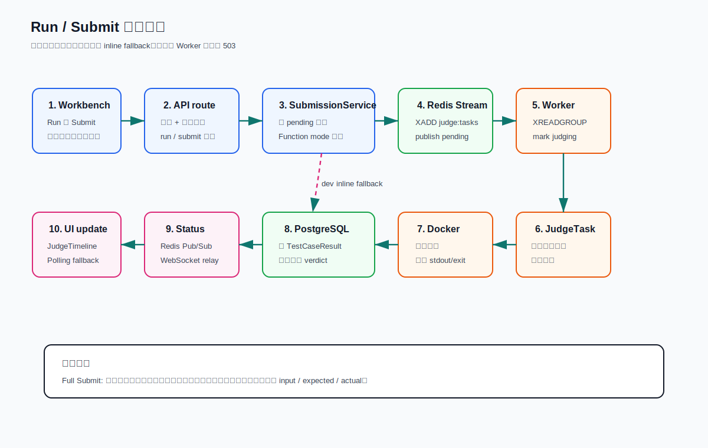
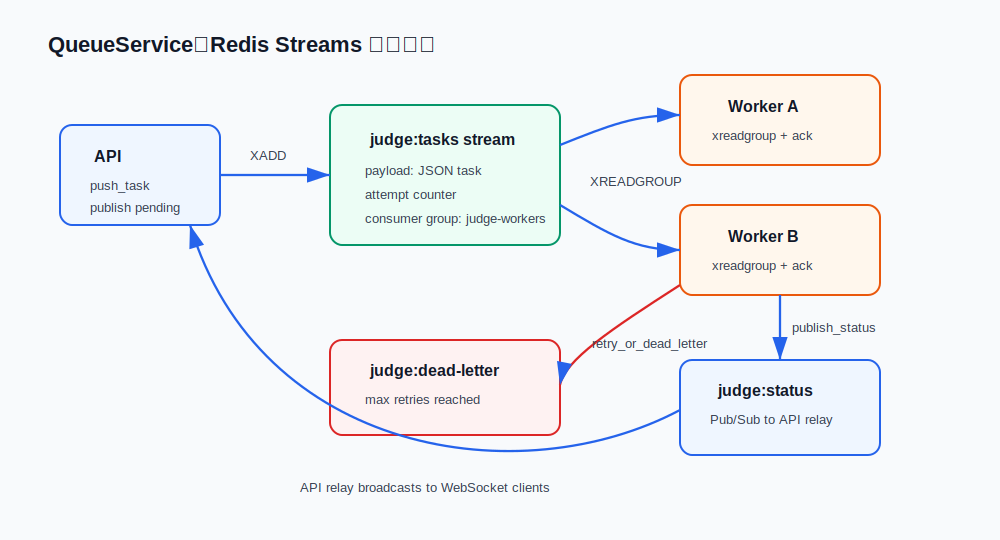

# 02. 判题链路深度讲解

判题链路是 FastOJ 最核心、最值得在面试中展开的部分。你需要能从前端按钮一路讲到 Docker 容器执行，再讲回数据库和 WebSocket。

## 一次 Run 或 Submit 的完整时序



## Run 和 Submit 的区别

前端工作台里的两个按钮不是同一个语义：

- **Run**：调用 `/api/v1/submissions/run`，只使用公开样例或用户编辑的公开运行输入，不触碰隐藏用例。
- **Submit**：调用 `/api/v1/submissions`，使用正式用例集合。公开用例失败时会提前停止，隐藏用例结果只给聚合状态，不返回隐藏内容。

API 路由分别在 [backend/api/submissions/run.py:13](../../backend/api/submissions/run.py#L13) 和 [backend/api/submissions/__init__.py:21](../../backend/api/submissions/__init__.py#L21)。

## SubmissionService：业务入口

`SubmissionService` 做四件事：

1. 校验语言、题目是否存在、私有题目权限。
2. Function mode 时把用户函数包装成可执行程序。
3. 创建 `Submission` 数据库记录，初始状态为 `pending`。
4. 按环境策略决定进入 Redis 队列还是开发期 inline 判题。

关键代码：

- 创建正式提交：[backend/services/submission_service.py:27](../../backend/services/submission_service.py#L27)
- 创建公开运行：[backend/services/submission_service.py:69](../../backend/services/submission_service.py#L69)
- Function mode 包装：[backend/services/submission_service.py:110](../../backend/services/submission_service.py#L110)
- 队列或 inline 判题选择：[backend/services/submission_service.py:132](../../backend/services/submission_service.py#L137)

`SubmissionService` 里有一个重要生产边界：inline judge 只在 `DEBUG=true` 或显式 `JUDGE_INLINE_FALLBACK=true` 时允许。`DEBUG=false` 时必须走 Redis Worker；如果没有 live worker heartbeat、Redis 不可用，或入队失败，提交 API 返回 `503 Judge service unavailable`，不会让 FastAPI API 进程承担判题负载。判断和策略入口看 [backend/services/submission_service.py:132](../../backend/services/submission_service.py#L137)。

## QueueService：Redis Streams 核心

当前打开的文件 [backend/services/queue_service.py](../../backend/services/queue_service.py) 是异步判题的队列抽象。它不是一个简单 list queue，而是基于 Redis Streams：



### 连接和命名

`QueueService.__init__` 从 settings 读取 stream、consumer group、dead-letter stream、status channel，并用 hostname 生成 consumer name。看 [backend/services/queue_service.py:10](../../backend/services/queue_service.py#L10)。

### Worker heartbeat

Heartbeat 用来判断是否有活着的判题 Worker：

- 写入 heartbeat：[backend/services/queue_service.py:36](../../backend/services/queue_service.py#L36)
- 扫描是否有活 Worker：[backend/services/queue_service.py:50](../../backend/services/queue_service.py#L50)

API 在生产策略下用 heartbeat 做提交前检查：没有 live worker 时直接拒绝提交。开发调试时可以通过 `DEBUG=true` 或 `JUDGE_INLINE_FALLBACK=true` 允许 inline fallback。Worker 进程用后台 heartbeat 线程持续续期，避免长时间判题时 heartbeat 过期造成误判。

### 入队

入队在 [backend/services/queue_service.py:59](../../backend/services/queue_service.py#L60)：

- `task_data.setdefault("attempt", 0)` 初始化重试次数。
- `ensure_group()` 确保 consumer group 存在。
- `xadd(queue_name, {"payload": json.dumps(task_data)})` 写入 stream。
- `publish_status` 和 `xadd` 已解耦：只要 `xadd` 成功，就不再因为状态发布失败而 inline 重复判题。

### 出队

出队在 [backend/services/queue_service.py:74](../../backend/services/queue_service.py#L74)：

- 使用 `xreadgroup`。
- group 是 `judge-workers`。
- consumer 是当前 Worker hostname。
- stream id 用 `>`，表示读取尚未投递给任何 consumer 的新消息。

### ack、retry 和 dead-letter

正常完成后调用 [ack_task](../../backend/services/queue_service.py#L91)。

异常时调用 [retry_or_dead_letter](../../backend/services/queue_service.py#L95)：

- 增加 `attempt`。
- 没超过最大重试次数时重新 `xadd` 回主 stream。
- 达到最大重试次数时写入 dead-letter stream。
- 最后 ack 原消息，避免同一条 pending 永远卡住。

### pending reclaim

[claim_pending](../../backend/services/queue_service.py#L113) 用来把长时间 idle 的 pending 消息 claim 给当前 consumer，并把 claim 到的 payload 送回 Worker 处理。它会跳过仍有 heartbeat 的其他 consumer，避免抢正在长时间判题的活跃 Worker。

### 状态发布

[publish_status](../../backend/services/queue_service.py#L151) 统一发布提交状态。消息结构固定为：

```text
type: pending | judging | progress | result | error
submission_id: 当前提交
data: 状态详情
```

API 启动时的 relay 会订阅 `judge:status` 并广播给对应 WebSocket 连接，代码在 [backend/api/websocket/status_relay.py:13](../../backend/api/websocket/status_relay.py#L13)。

## Worker：消费和状态更新

Worker 的核心类是 [JudgeTaskConsumer](../../backend/worker/tasks/consumer.py#L13)。`process_task` 的职责：

1. 读取任务中的 `submission_id`。
2. 从 DB 加载提交。
3. 如果提交已经完成并有结果，ack 掉重复任务。
4. 标记提交为 `judging`。
5. 调用 `JudgeTask.execute`。
6. 写入最终状态。
7. 发布 `result` 事件。
8. ack 原 stream message。
9. 如果 Worker 异常且还有重试次数，任务重新入队，submission 回到 `pending`；达到最终重试才写 `SE` 和 dead-letter。

关键入口：[backend/worker/tasks/consumer.py:19](../../backend/worker/tasks/consumer.py#L19)。

## JudgeTask：执行测试用例

[JudgeTask.execute](../../backend/worker/tasks/judge_task.py#L126) 做的是判题语义，不负责队列：

- 加载 Problem。
- 按 Run/Submit 选择公开用例、全部用例或用户自定义公开运行输入。
- 对每个 testcase 调 `SandboxExecutor.execute`。
- 比较实际输出和期望输出。
- 写 `TestCaseResult`。
- 发布 progress。
- 汇总最终 verdict。

隐藏用例保护发生在写结果时：隐藏用例的 `input`、`expected_output`、`actual_output` 都写成 `None`，看 [backend/worker/tasks/judge_task.py:216](../../backend/worker/tasks/judge_task.py#L216)。

## SandboxExecutor：Docker-first 执行

[SandboxExecutor.execute](../../backend/sandbox/executor.py#L61) 先判断语言是否支持，再优先走 Docker。Docker 执行入口是 [backend/sandbox/executor.py:118](../../backend/sandbox/executor.py#L118)。

关键安全参数：

- 禁用网络：[backend/sandbox/executor.py:146](../../backend/sandbox/executor.py#L146)
- 限制进程数：[backend/sandbox/executor.py:147](../../backend/sandbox/executor.py#L147)
- 丢弃 Linux capabilities：[backend/sandbox/executor.py:148](../../backend/sandbox/executor.py#L148)
- no-new-privileges：[backend/sandbox/executor.py:149](../../backend/sandbox/executor.py#L149)
- 非 root 用户运行：[backend/sandbox/executor.py:152](../../backend/sandbox/executor.py#L152)
- 输出截断：[backend/sandbox/executor.py:221](../../backend/sandbox/executor.py#L221)

生产约束是 Docker-first。只有显式打开 `FASTOJ_ALLOW_UNSAFE_LOCAL_EXECUTION` 才可能走宿主机 subprocess fallback，默认关闭，配置见 [backend/core/config.py:47](../../backend/core/config.py#L47)。

## 前端如何接收结果

工作台提交入口是 [frontend/src/main.tsx:1675](../../frontend/src/main.tsx#L1675)。提交创建成功后调用 [connectStatus](../../frontend/src/main.tsx#L1716)：

- 优先创建 WebSocket：[frontend/src/lib/api.ts:564](../../frontend/src/lib/api.ts#L564)
- 同时启动轮询，每 1.6 秒拉取提交详情。
- WebSocket 收到 result 后停止轮询。
- 如果 WebSocket 丢事件，轮询看到 finished 会补一个 terminal event。

这个设计让用户体验实时，但最终状态不完全依赖 WebSocket。

## 常见追问

**为什么用 Redis Streams，不用 Redis list？**

Streams 有 consumer group、ack、pending、claim、message id 和 dead-letter 设计空间，更适合多个 Worker 并发消费和失败恢复。

**Worker 崩了怎么办？**

未 ack 的消息会留在 pending 里，`claim_pending` 可以把 idle 太久、且 owner heartbeat 已失效的消息 claim 给当前 consumer。真正生产化还要加队列仪表盘和 dead-letter 告警。

**隐藏用例会不会通过 WebSocket 泄露？**

不会。JudgeTask 存储隐藏结果时不保存输入、期望和实际输出；WebSocket progress 对 full submit 的隐藏阶段也只发聚合进度，不发 case 内容。

## 代码导航

- Run API：[backend/api/submissions/run.py:13](../../backend/api/submissions/run.py#L13)
- Submit API：[backend/api/submissions/__init__.py:21](../../backend/api/submissions/__init__.py#L21)
- 提交服务：[backend/services/submission_service.py:27](../../backend/services/submission_service.py#L27)
- 队列服务：[backend/services/queue_service.py:10](../../backend/services/queue_service.py#L10)
- 入队：[backend/services/queue_service.py:56](../../backend/services/queue_service.py#L56)
- 出队：[backend/services/queue_service.py:74](../../backend/services/queue_service.py#L74)
- retry/dead-letter：[backend/services/queue_service.py:95](../../backend/services/queue_service.py#L95)
- Worker 消费：[backend/worker/tasks/consumer.py:19](../../backend/worker/tasks/consumer.py#L19)
- 判题执行：[backend/worker/tasks/judge_task.py:126](../../backend/worker/tasks/judge_task.py#L126)
- Docker 沙箱：[backend/sandbox/executor.py:118](../../backend/sandbox/executor.py#L118)
- 前端提交：[frontend/src/main.tsx:1675](../../frontend/src/main.tsx#L1675)
