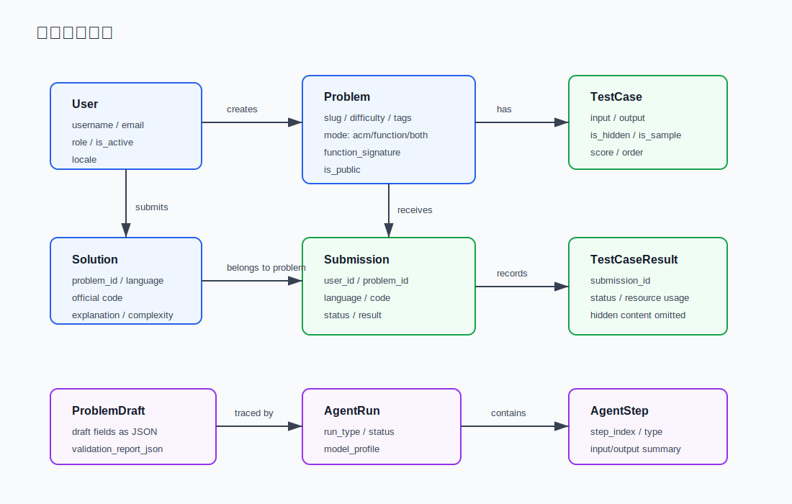

# 03. 数据模型与题目模式

FastOJ 的数据模型围绕一个问题展开：如何既支持传统 ACM stdin/stdout，又支持 LeetCode 风格的 Function mode，同时还要保存提交、用例结果、官方解法、AI 出题草稿和导入题目草稿。

## 核心数据关系



## 表模型怎么读

核心模型都在 [backend/models/__init__.py](../../backend/models/__init__.py)：

- `User`：[backend/models/__init__.py:46](../../backend/models/__init__.py#L46)，保存账号、角色、状态、语言偏好。
- `Problem`：[backend/models/__init__.py:63](../../backend/models/__init__.py#L63)，保存题目正文、难度、标签、模式、时间/内存限制、是否公开。
- `TestCase`：[backend/models/__init__.py:97](../../backend/models/__init__.py#L97)，保存输入、输出、隐藏/样例标记、分数、顺序；`io_metadata_json` 可为同一逻辑用例保存 ACM 和 Function 两种展示/判题视图。
- `Submission`：[backend/models/__init__.py:113](../../backend/models/__init__.py#L113)，保存用户代码、语言、状态、结果和资源使用。
- `TestCaseResult`：[backend/models/__init__.py:141](../../backend/models/__init__.py#L141)，保存每个 testcase 的执行结果。
- `Solution`：[backend/models/__init__.py:159](../../backend/models/__init__.py#L159)，保存官方解法和复杂度。
- `ProblemDraft`、`AgentRun`、`AgentStep`：[backend/models/__init__.py:199](../../backend/models/__init__.py#L199)，保存 AI 出题/导入草稿、运行轨迹和步骤。导入草稿的 `source_metadata_json` 保存管理员可见的来源信息和原始材料。

## 状态和值域

提交状态和判题结果是两个不同概念：

- `SubmissionStatus`：`pending`、`judging`、`finished`。表示生命周期。
- `SubmissionResult`：`ac`、`wa`、`tle`、`mle`、`ce`、`re`、`se`。表示最终 verdict。

定义在 [backend/models/__init__.py:20](../../backend/models/__init__.py#L20) 和 [backend/models/__init__.py:26](../../backend/models/__init__.py#L26)。

## ACM mode

ACM mode 是传统 OJ 模式：

1. 用户写完整程序。
2. 程序从 stdin 读输入。
3. 程序向 stdout 输出答案。
4. 沙箱直接执行用户程序。
5. JudgeTask 比较 stdout 和 testcase.output。

前端 ACM starter 在 [frontend/src/lib/problemModes.ts:148](../../frontend/src/lib/problemModes.ts#L148)。后端不需要额外包装，`SubmissionService._prepare_judge_code` 会直接返回用户代码，看 [backend/services/submission_service.py:126](../../backend/services/submission_service.py#L126)。

## Function mode

Function mode 更像 LeetCode：

1. 用户只写函数或 `Solution` 类方法。
2. 后端根据题目 slug 或 `function_signature` 生成 stdin/stdout harness。
3. harness 负责解析 testcase input、调用用户函数、格式化返回值。
4. 沙箱执行的是包装后的完整程序。

包装入口在 [backend/services/function_mode.py:2468](../../backend/services/function_mode.py#L2468)。如果题目有动态 `function_signature`，会优先使用动态包装；否则使用内置 `FUNCTION_ENTRYPOINTS`。

前端负责生成对应语言 starter，入口是 [frontend/src/lib/problemModes.ts:712](../../frontend/src/lib/problemModes.ts#L712)。题目支持什么模式由 [getProblemMode](../../frontend/src/lib/problemModes.ts#L680) 判断。

## 两种模式如何共存

`Problem.mode` 当前可以是：

- `acm`：只提供 stdin/stdout。
- `function`：只提供函数式练习。
- `both`：同时支持两种练习方式。

对于 `both`，题目可以保存同一逻辑用例的两种视图：

- `acm`：传统 stdin/stdout 文本，例如第一行 `Q`，后续每行一条操作。
- `function`：函数调用合同需要的 JSON-line 或 JSON 值，例如参数数组和返回值数组。

旧数据没有 `io_metadata_json` 时仍回退使用 `TestCase.input/output`。新导入题和需要双模式精确展示的题应写入 `io_metadata_json`，问题详情 API 会根据 `judge_mode=acm|function` 返回当前视图，同时保留可选的 `acm_input/acm_output/function_input/function_output` 供前端调试和展示。

## Seed 官方题解与用例

内置 seed catalog 当前有 108 道题。所有 seed 题的 Python 官方题解都集中在
[backend/scripts/seed_official_solutions.py](../../backend/scripts/seed_official_solutions.py)，
`seed_data.py` 会从这个 registry 写入或覆盖 `Solution` 行，避免数据库继续保留 starter
placeholder 或 `TODO` 题解。

seed 用例增强在
[backend/scripts/seed_testcase_augmentation.py](../../backend/scripts/seed_testcase_augmentation.py)。
它用确定性输入生成每题至少两个公开用例，并按题型保证隐藏用例下限：普通题 30+，设计类
和 AI/ML 题 20+，高输出组合题 15+。生成期望输出时会调用同一 slug 的官方函数，并对多答案
题保持 canonical 输出顺序，减少“合法顺序不同”带来的误判。

seed 展示文案在
[backend/scripts/seed_explanations.py](../../backend/scripts/seed_explanations.py)。问题详情 API
按 `locale` 返回公开示例解释，题解 API 也从同一 registry 返回中英文真实解法说明；非 seed 题没有
registry 文案时返回空解释，不由前端生成模板。

公开题解接口仍支持按当前语言查询；如果指定语言没有官方题解，会回退返回 Python 官方题解，
响应中的 `language` 字段仍保留真实值 `python`。

## 草稿来源元数据

`ProblemDraft.source_metadata_json` 用来区分草稿来源：

- `kind: "generated"`：原创出题 Agent 生成的草稿。
- `kind: "imported"`：导入题目 Agent 从管理员粘贴的外部材料生成的草稿。

导入草稿会保存 `source_url`、`raw_material`、`raw_material_length`、`import_notes` 和 `rewrite_policy`。这些字段只通过管理员草稿接口展示，用于追溯和返工；批准发布后的普通 `Problem` 响应不包含导入原文或 source metadata。对应模型字段在 [backend/models/__init__.py:229](../../backend/models/__init__.py#L229)，管理员响应转换在 [backend/api/admin_agent.py:338](../../backend/api/admin_agent.py#L338)。

## 用例输入格式

Function mode 当前使用 JSON-line 风格输入。例如 Two Sum 可以是：

```text
[2,7,11,15]
9
```

包装器按函数参数逐行读取并解析。AI 出题校验中也接受一些常见 AI 生成形状，比如 JSON array 或按参数名的 object，入口在 [backend/services/problem_authoring_agent.py:58](../../backend/services/problem_authoring_agent.py#L58)。

ACM mode 则由题目的 `input_format` 和 `output_format` 约定，用户程序自己解析 stdin。

## Markdown 展示

题目描述、提示、样例解释、官方题解、讨论正文和管理员草稿预览都按 Markdown 文本存储并在前端统一渲染。前端使用 `MarkdownBlock` 组件做 Markdown 到 HTML 的转换和 sanitize；编辑侧仍然是普通 textarea，不引入富文本存储。

## Public run 的自定义输入

用户在工作台编辑公开运行输入时，客户端只提交 `input`，不会提交 expected output。后端用官方解法或安全内置参考生成 expected output。这样可以防止用户伪造期望输出。

关键逻辑在：

- Run payload 只保留 input：[backend/services/submission_service.py:118](../../backend/services/submission_service.py#L118)
- 生成自定义运行用例：[backend/worker/tasks/judge_task.py:360](../../backend/worker/tasks/judge_task.py#L360)
- 用官方解法生成 expected output：[backend/worker/tasks/judge_task.py:376](../../backend/worker/tasks/judge_task.py#L376)

## 隐藏用例的数据边界

隐藏用例可以保存在数据库中，管理员可以管理，但普通提交详情不能返回隐藏输入、期望输出或实际输出。

JudgeTask 写 `TestCaseResult` 时对隐藏用例做了空值处理：[backend/worker/tasks/judge_task.py:219](../../backend/worker/tasks/judge_task.py#L219)。

普通用户获取提交详情时还会过滤隐藏结果：[backend/api/submissions/__init__.py:85](../../backend/api/submissions/__init__.py#L85)。

## 代码导航

- SQLAlchemy 模型：[backend/models/__init__.py:46](../../backend/models/__init__.py#L46)
- Problem 模型：[backend/models/__init__.py:63](../../backend/models/__init__.py#L63)
- Submission 模型：[backend/models/__init__.py:113](../../backend/models/__init__.py#L113)
- ProblemDraft source metadata：[backend/models/__init__.py:229](../../backend/models/__init__.py#L229)
- Seed 官方题解：[backend/scripts/seed_official_solutions.py](../../backend/scripts/seed_official_solutions.py)
- Seed 用例增强：[backend/scripts/seed_testcase_augmentation.py](../../backend/scripts/seed_testcase_augmentation.py)
- Seed 展示解释：[backend/scripts/seed_explanations.py](../../backend/scripts/seed_explanations.py)
- Function mode 包装入口：[backend/services/function_mode.py:2468](../../backend/services/function_mode.py#L2468)
- 前端题目模式判断：[frontend/src/lib/problemModes.ts:680](../../frontend/src/lib/problemModes.ts#L680)
- 前端 starter 生成：[frontend/src/lib/problemModes.ts:712](../../frontend/src/lib/problemModes.ts#L712)
- 隐藏结果写入保护：[backend/worker/tasks/judge_task.py:219](../../backend/worker/tasks/judge_task.py#L219)

## 讲解口径

讲 Function mode 时可以按这条主线说明：

Function mode is implemented as a transformation layer. The user writes only the target function, but before judging we wrap it with a generated harness based on the problem signature. The harness parses JSON-line input, calls the user function, formats the return value, and then the sandbox still executes a normal stdin/stdout program. This lets the judge pipeline stay unified for both ACM and Function mode.
