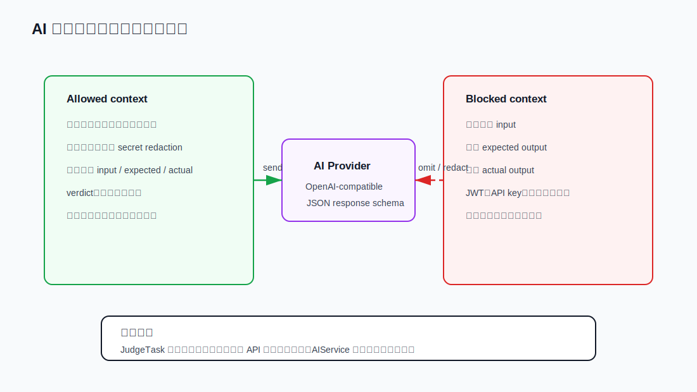
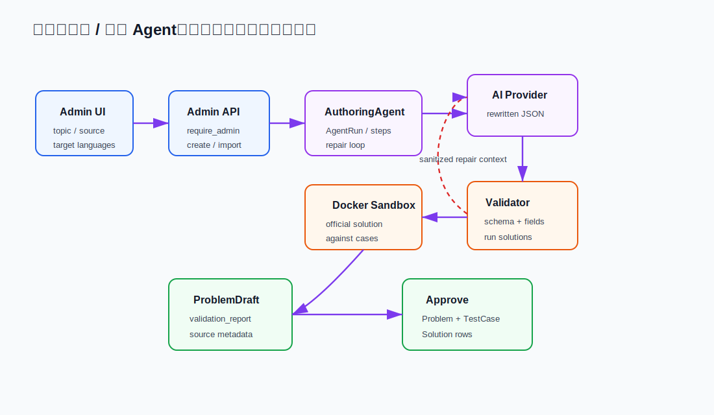

# 04. AI 接入与安全边界

FastOJ 的 AI 不是简单把数据库里的所有信息发给模型。它的核心设计是：AI 可以帮助解释、提示、审查和出题，但不能看到隐藏用例内容，也不能把完整答案直接交给用户。

## AI 能做什么

当前 AI 能力主要有两类：

1. 学习者侧：
   - 提交解释：为什么失败、可能原因、下一步建议。
   - 代码审查：复杂度、边界风险、I/O 格式问题。
   - 渐进提示：按轻提示、方向提示、重提示三个强度给动态提示。
   - 对话：围绕当前提交上下文继续问。
2. 管理员侧：
   - 生成题目草稿。
   - 导入粘贴的外部题面、样例、解释和解法材料，并重写成平台草稿。
   - 生成多语言官方解法。
   - 校验草稿和用例。
   - 自动修复 validation failed 的草稿，但隐藏内容仍会被过滤。

AI API 路由在 [backend/api/ai.py:22](../../backend/api/ai.py#L22)，业务逻辑在 [backend/ai/service.py:25](../../backend/ai/service.py#L25)。

## Provider profile

FastOJ 使用 OpenAI-compatible provider 抽象，不把某一家模型服务写死在业务里。前端通过 `GET /api/v1/ai/profiles` 获取可用 profile，普通用户只看到可用模型，管理员可以看到不可用原因摘要。

入口：

- AI profiles API：[backend/api/ai.py:25](../../backend/api/ai.py#L25)
- 服务初始化选择 profile：[backend/ai/service.py:25](../../backend/ai/service.py#L25)
- AI 配置字段：[backend/core/config.py:57](../../backend/core/config.py#L57)
- AI 响应语言映射：[backend/core/locales.py:36](../../backend/core/locales.py#L36)

## 安全上下文：什么能给 AI，什么不能

AIService 构造提交上下文时只遍历公开 testcase result。隐藏 result 只会影响 `hidden_failure_notice`，不会带输入输出内容。看 [backend/ai/service.py:112](../../backend/ai/service.py#L112) 和 [backend/ai/service.py:132](../../backend/ai/service.py#L132)。

用户代码和问题文本还会经过 secret redaction，入口在 [backend/ai/service.py:287](../../backend/ai/service.py#L287)。

## 提示和解释的约束

`AIService` 对不同能力设置了不同规则：

- explain/review 使用当前提交上下文，但产品语义不同：explain 面向最近一次 verdict，解释失败原因、可疑区域和下一步；review 面向代码审查，检查算法思路、复杂度、边界和 I/O 风险。
- hint 使用题目上下文、语言和当前代码，但不使用隐藏用例。前端显示为“轻提示 / 方向提示 / 重提示”，强度逐级增加。
- chat 明确加规则：只使用公开 testcase details、不暴露隐藏用例、不返回完整 AC 解法。

chat 的 rules 在 [backend/ai/service.py:62](../../backend/ai/service.py#L62)，hint 的 rules 在 [backend/ai/service.py:90](../../backend/ai/service.py#L90)。

即使模型返回字段不稳定，AIService 也会做 schema 兼容和兜底解析，例如 `_parse_explain`、`_parse_review`、`_parse_chat`，避免前端直接渲染不可控结构。

注意区分两类“提示”：

- **官方提示**：题目作者写好的固定内容，显示在工作台左侧题目详情中，类似 LeetCode 的 hint。它来自题目数据，不调用 AI，也不依赖用户当前代码。
- **AI 提示**：学习者在右侧 AI 判题助手里主动请求的动态内容。它会结合当前题目、语言和代码，但仍然不能看到隐藏用例。

## 出题 Agent 流程

管理员出题 Agent 是一个“生成/导入、校验、修复、入库”的闭环：

关键代码：

- 最大修复次数：[backend/services/problem_authoring_agent.py:36](../../backend/services/problem_authoring_agent.py#L36)
- 草稿校验器：[backend/services/problem_authoring_agent.py:95](../../backend/services/problem_authoring_agent.py#L95)
- 创建草稿流程：[backend/services/problem_authoring_agent.py:353](../../backend/services/problem_authoring_agent.py#L353)
- 导入草稿流程：[backend/services/problem_authoring_agent.py:373](../../backend/services/problem_authoring_agent.py#L373)
- 导入专用 prompt：[backend/ai/prompts/problem_authoring.py:19](../../backend/ai/prompts/problem_authoring.py#L19)
- 批准草稿发布正式题目：[backend/services/problem_authoring_agent.py:500](../../backend/services/problem_authoring_agent.py#L500)

## 导入题目 Agent 的边界

导入题目 Agent 接收管理员粘贴的大段原始材料和可选来源链接。和原创出题不同，它的 prompt 会先要求模型抽取题意、样例、约束和解法线索，再输出 FastOJ 现有 `AuthoredProblemDraft` JSON schema。关键约束是：

- 题面、样例解释和官方解法必须重写，不能逐句复制外部原文。
- 导入的代码只能作为思路参考，官方解法要按 FastOJ 当前语言和模式重新整理。
- 函数模式、ACM 模式和双模式仍要符合当前平台的输入输出合同。
- 原始材料保存到 `ProblemDraft.source_metadata_json`，只在管理员草稿 UI/API 中展示。
- 普通题面接口、普通用户页面和学习者侧 AI 上下文不返回 `raw_material`。

入口包括 [ProblemImportRequest](../../backend/schemas/problem_authoring.py#L78)、[POST /api/v1/admin/agent/problem-imports](../../backend/api/admin_agent.py#L49) 和 [build_import_prompt](../../backend/ai/prompts/problem_authoring.py#L105)。

## Agent 修复为什么安全

草稿校验失败后，Agent 可能把失败摘要发回模型要求修复。但它不会把上一版隐藏用例内容原样发回。`_validation_repair_context` 会：

- 收集隐藏用例中的较长敏感值。
- 对题面、解法、解释、validation notes 做替换。
- 只保留公开样例内容。
- 对隐藏用例只给数量和聚合 case summary。

入口：[backend/services/problem_authoring_agent.py:1201](../../backend/services/problem_authoring_agent.py#L1201)。

## 隐藏用例的三道防线

1. **判题写库时隐藏内容不写到结果表**：见 [backend/worker/tasks/judge_task.py:219](../../backend/worker/tasks/judge_task.py#L219)。
2. **普通提交详情过滤隐藏结果**：见 [backend/api/submissions/__init__.py:85](../../backend/api/submissions/__init__.py#L85)。
3. **AI 上下文只加入公开 result**：见 [backend/ai/service.py:112](../../backend/ai/service.py#L112)。

这三层分别保护数据库结果、API 响应和外部 AI provider。

## 常见追问

**如果模型返回完整答案怎么办？**

服务端响应 schema 中保留 `full_solution_revealed` 这类安全标记，并且解析时会强制置为 false。产品层也把 AI 定位成提示和解释，而不是直接生成完整答案给普通用户。

**如果隐藏用例失败，AI 怎么帮助用户？**

AI 不知道隐藏输入输出，只知道有隐藏用例失败。它可以基于题面、代码、公开用例和 verdict 提醒常见边界类别，比如空数组、重复值、极限大小、格式问题。

**管理员能看到隐藏用例，是否会泄露到 AI？**

管理员 API 可以管理隐藏用例，但出题 Agent 的修复上下文和普通 AI 解释上下文都做了隐藏内容省略或 redaction。管理员 UI 不是安全边界，服务端检查才是安全边界。

**导入原文会不会发给普通用户或普通 AI 功能？**

不会。导入原文只在创建导入草稿时发送给管理员选择的 AI provider，并保存为管理员可见的草稿元数据。批准后的正式题目只继承重写后的题面、样例、用例和官方解法；普通问题接口和学习者侧 AI prompt 不读取 `source_metadata_json`。

## 代码导航

- AI API：[backend/api/ai.py:22](../../backend/api/ai.py#L22)
- AIService：[backend/ai/service.py:25](../../backend/ai/service.py#L25)
- Locale registry：[backend/core/locales.py:5](../../backend/core/locales.py#L5)
- 提交安全上下文：[backend/ai/service.py:112](../../backend/ai/service.py#L112)
- 隐藏失败摘要：[backend/ai/service.py:132](../../backend/ai/service.py#L132)
- secret redaction：[backend/ai/service.py:287](../../backend/ai/service.py#L287)
- 出题 Agent：[backend/services/problem_authoring_agent.py:353](../../backend/services/problem_authoring_agent.py#L353)
- 导入题目 Agent：[backend/services/problem_authoring_agent.py:373](../../backend/services/problem_authoring_agent.py#L373)
- Agent 修复上下文：[backend/services/problem_authoring_agent.py:1201](../../backend/services/problem_authoring_agent.py#L1201)
- Admin Agent API：[backend/api/admin_agent.py:25](../../backend/api/admin_agent.py#L25)
