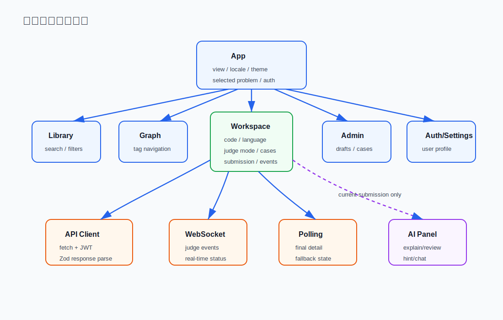

# 05. 前端导览

FastOJ 前端是 React + TypeScript + Vite。它不是多页面路由应用，而是在一个 App 里维护当前 view，并根据 view 渲染题库、工作台、图谱、认证、设置和管理后台。

## 前端结构总览

主入口在 [frontend/src/main.tsx:3449](../../frontend/src/main.tsx#L3449)，React root 在 [frontend/src/main.tsx:3582](../../frontend/src/main.tsx#L3582)。

## App 级状态

`App` 维护这些关键状态：

- `view`：当前页面，可能是 `library`、`workbench`、`graph`、`auth`、`settings`、`admin`。
- `selectedId`：当前题目 id。
- `locale`：当前界面语言，来自 `SUPPORTED_LOCALES`。
- `theme`：浅色或深色。
- `authenticated` 和 `currentUser`：登录状态和用户资料。

看 [frontend/src/main.tsx:3449](../../frontend/src/main.tsx#L3449)。`document.documentElement.lang` 由 `htmlLangForLocale` 设置，语言偏好会写 localStorage，并且登录后同步到账户，逻辑在 [frontend/src/main.tsx:3462](../../frontend/src/main.tsx#L3462) 和 [frontend/src/main.tsx:3520](../../frontend/src/main.tsx#L3520)。

## 国际化扩展点

长期扩展语言时，先改 [frontend/src/lib/i18n.ts:4](../../frontend/src/lib/i18n.ts#L4) 的 `LOCALE_META` 和文案表，而不是在组件里新增二分判断。关键规则：

- `SUPPORTED_LOCALES` 驱动设置页语言按钮和 starter 模板去重。
- `htmlLangForLocale` 驱动页面 `lang` 属性。
- `nextLocale` 驱动顶部快速切换按钮。
- `localeText` 和 `localeValue` 给 UI 文案和列表数据提供默认 locale 回退。
- 后端请求校验使用 [backend/core/locales.py:30](../../backend/core/locales.py#L30) 的 `validate_locale`，数据库旧值读取使用 `normalize_locale` 兜底。

## API client

API client 统一在 [frontend/src/lib/api.ts:325](../../frontend/src/lib/api.ts#L325)。它负责：

- 拼接 `API_BASE`。
- 附带 JWT。
- 解析 FastAPI 错误并做安全格式化。
- 用 Zod schema 校验重要响应。
- 提供问题、提交、AI、管理后台等方法。

提交入口是 [frontend/src/lib/api.ts:487](../../frontend/src/lib/api.ts#L487)，WebSocket 创建在 [frontend/src/lib/api.ts:564](../../frontend/src/lib/api.ts#L564)。

## 题库页

题库页入口：[frontend/src/main.tsx:455](../../frontend/src/main.tsx#L455)。

它做的事情：

- 调用 `api.problems` 获取题目。
- 支持关键词、难度、标签筛选。
- 支持卡片布局和传统 OJ 列表布局。
- 支持从训练图谱带 tag 回到题库。
- 用 `matchesLocalizedProblem` 支持中英文搜索。

本地化搜索入口：[frontend/src/lib/i18n.ts:580](../../frontend/src/lib/i18n.ts#L580)。

## 工作台是前端最重要的组件

`Workspace` 入口在 [frontend/src/main.tsx:1227](../../frontend/src/main.tsx#L1227)。它承担了刷题体验的核心状态：

- 当前代码。
- 当前语言。
- 当前 judge mode。
- AI 模型 profile。
- 左右面板宽度和打开状态。
- 当前提交和判题事件。
- public run cases。
- AI explain/review/hint/chat 状态。
- 当前题目和提交轨迹 query。

工作台的基本数据流：

上图下半部分就是工作台的数据流：用户动作进入 `judge(runOnly)`，再经 `api.submit` 到后端；提交创建后，`connectStatus` 同时连接 WebSocket 和 polling fallback，最终更新 JudgeTimeline、RunResultPanel 和 AI panel。

提交动作在 [frontend/src/main.tsx:1456](../../frontend/src/main.tsx#L1456)，状态连接在 [frontend/src/main.tsx:1497](../../frontend/src/main.tsx#L1497)。

## WebSocket-first + polling fallback

前端不会只依赖 WebSocket。`connectStatus` 会同时：

1. 打开 WebSocket 接收 `pending`、`progress`、`result`。
2. 启动 interval polling 获取提交详情。
3. 如果 WebSocket 先收到 result，就停止 polling。
4. 如果 WebSocket 漏掉 result，polling 看到 `finished` 后补一个终态事件。

这让实时体验和最终一致性都更稳。

## RunResultPanel

`RunResultPanel` 展示公开运行输入、官方期望输出、用户实际输出和 diff。它只处理公开 run 的输入输出，不展示隐藏用例内容。入口在 [frontend/src/main.tsx:1765](../../frontend/src/main.tsx#L1765)，组件文件在 [frontend/src/components/RunResultPanel.tsx](../../frontend/src/components/RunResultPanel.tsx)，并通过 lazy component 按需加载。

## AI Copilot Panel

AI 面板入口在 [frontend/src/main.tsx:1799](../../frontend/src/main.tsx#L1799)。它依赖当前 `submission`，并通过这些函数调用后端：

- explain：[frontend/src/main.tsx:1551](../../frontend/src/main.tsx#L1551)
- review：[frontend/src/main.tsx:1576](../../frontend/src/main.tsx#L1576)
- hint：[frontend/src/main.tsx:1594](../../frontend/src/main.tsx#L1594)
- chat：[frontend/src/main.tsx:1612](../../frontend/src/main.tsx#L1612)

工作台会在新题目、新提交、语言变化时清理旧 AI 状态，避免旧提交的解释出现在新提交上。

## Function/ACM starter

前端负责给用户展示 starter code：

- 支持语言列表：[frontend/src/stores/useAppStore.ts:5](../../frontend/src/stores/useAppStore.ts#L5)
- 判断题目支持模式：[frontend/src/lib/problemModes.ts:680](../../frontend/src/lib/problemModes.ts#L680)
- 生成 starter：[frontend/src/lib/problemModes.ts:712](../../frontend/src/lib/problemModes.ts#L712)

前端只是改善用户体验，真正的 Function mode 判题仍由后端包装和 Docker 沙箱执行。

## AdminPage

管理后台入口在 [frontend/src/main.tsx:2271](../../frontend/src/main.tsx#L2271)。它覆盖：

- 用户管理。
- 题目基础信息管理。
- 用例管理。
- 官方解法管理。
- AI 出题 Agent 草稿、校验、发布。

注意：前端是否显示 admin 页面不是安全边界。后端管理接口使用 `require_admin` 做服务端角色检查。

## 打包与懒加载

前端仍然是单入口状态驱动的 SPA，但重组件不会全部同步进入首屏 bundle。lazy component 声明在 [frontend/src/main.tsx:67](../../frontend/src/main.tsx#L67) 附近：

- `CodeEditor`：进入工作台编辑区时加载，Monaco 使用 ESM editor API、显式 `editor.worker` 和 FastOJ 支持语言贡献。
- `CodeBlock`：题解代码出现时加载，Shiki 使用 `shiki/core`，按实际语言动态加载 grammar 和 `github-dark` theme。
- `TrainingGraph`、`JudgeTimeline`、`AICopilotPanel`、`RunResultPanel`、`SubmissionTrail`、`AuthPage`、`SettingsPage`：按 view 或 tab 渲染时加载。

当前生产 build 的主入口 `index-*.js` 约 499.81 kB，剩余 Vite 大 chunk 警告来自 lazy-loaded Monaco editor API 和 Shiki C++ grammar，不代表首屏同步包又变大。

## 代码导航

- React App：[frontend/src/main.tsx:3449](../../frontend/src/main.tsx#L3449)
- lazy component 声明：[frontend/src/main.tsx:67](../../frontend/src/main.tsx#L67)
- 题库页：[frontend/src/main.tsx:455](../../frontend/src/main.tsx#L455)
- 工作台：[frontend/src/main.tsx:1227](../../frontend/src/main.tsx#L1227)
- 提交动作：[frontend/src/main.tsx:1456](../../frontend/src/main.tsx#L1456)
- 状态连接：[frontend/src/main.tsx:1497](../../frontend/src/main.tsx#L1497)
- API client：[frontend/src/lib/api.ts:325](../../frontend/src/lib/api.ts#L325)
- WebSocket 创建：[frontend/src/lib/api.ts:564](../../frontend/src/lib/api.ts#L564)
- starter 生成：[frontend/src/lib/problemModes.ts:712](../../frontend/src/lib/problemModes.ts#L712)
- locale registry：[frontend/src/lib/i18n.ts:4](../../frontend/src/lib/i18n.ts#L4)
- locale fallback helpers：[frontend/src/lib/i18n.ts:52](../../frontend/src/lib/i18n.ts#L52)

## 面试讲法

前端回答不要只说 “React”。更好的说法是：

The frontend is organized around the learner workflow. The workbench owns the active problem, language, judge mode, code draft, run cases, submission state, WebSocket events, polling fallback, and AI panel state. TanStack Query handles server data like problems, solutions, profiles, and submission history, while local UI preferences such as theme, panel sizes, drafts, and locale are stored locally or synced to the user profile.
