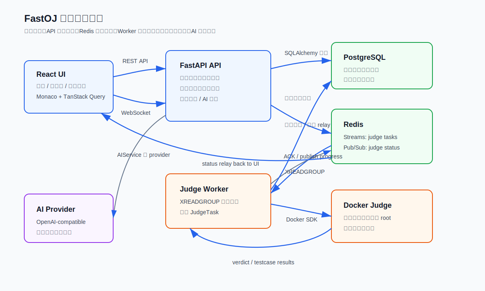

# FastOJ 项目深度教学指南

这组文档是给新人快速上手 FastOJ 用的。阅读顺序按“先全局、再链路、再细节、最后对外讲解”设计，目标不是背代码，而是让你能解释每个关键设计为什么存在、请求如何流动、数据如何落库、哪里有安全边界。

如果只想快速把项目主线讲清楚，先读 [07-project-explainer.md](07-project-explainer.md)，再回来看判题链路和 AI 安全边界。

## 学习路线

如果是第一次读，建议先把每篇当成“流程说明”看，不要一开始就逐个点击代码锚点。第一遍只建立系统地图；第二遍从一个请求追到数据库、队列和前端状态；第三遍再打开锚点确认实现细节。

1. 先读 [01-architecture.md](01-architecture.md)：知道 FastOJ 是什么，服务如何部署，FastAPI、PostgreSQL、Redis、Worker、Docker 和 React 如何配合。
2. 再读 [02-judge-pipeline.md](02-judge-pipeline.md)：这是项目的核心链路，重点理解提交从前端到 Docker 沙箱再回到 WebSocket 的全过程。
3. 接着读 [03-data-and-problem-modes.md](03-data-and-problem-modes.md)：把表结构、题目模式、测试用例和提交结果串起来。
4. 然后读 [04-ai-and-safety.md](04-ai-and-safety.md)：讲清楚 AI 如何接入、出题/导入 Agent 如何工作、为什么不会泄露隐藏用例或导入原文。
5. 再读 [05-frontend-tour.md](05-frontend-tour.md)：理解单页 React 应用、工作台状态、Admin 导入表单、API client、WebSocket 和 polling fallback。
6. 再读 [06-ops-and-testing.md](06-ops-and-testing.md)：知道如何启动、验证、部署、排障。
7. 最后读 [07-project-explainer.md](07-project-explainer.md)：把前面的内容整理成一条可以对外讲清楚的项目主线。

## 文档目录

| 文件 | 适合解决的问题 |
| --- | --- |
| [01-architecture.md](01-architecture.md) | “这个项目整体架构是什么？” |
| [02-judge-pipeline.md](02-judge-pipeline.md) | “一次提交到底发生了什么？” |
| [03-data-and-problem-modes.md](03-data-and-problem-modes.md) | “数据库怎么建模？Function mode 和 ACM mode 怎么兼容？” |
| [04-ai-and-safety.md](04-ai-and-safety.md) | “AI 接入在哪里？出题/导入 Agent 怎么避免泄露？” |
| [05-frontend-tour.md](05-frontend-tour.md) | “前端页面、工作台和 Admin 导入表单怎么组织？” |
| [06-ops-and-testing.md](06-ops-and-testing.md) | “怎么启动、测试、部署和排障？” |
| [07-project-explainer.md](07-project-explainer.md) | “如何用一条清晰主线讲 FastOJ？” |

## 总体架构图

这个图可以作为项目讲解的第一层：前端负责交互，API 负责鉴权和业务入口，数据库保存题目/提交/结果，Redis Streams 解耦异步判题，Worker parent 监督 judge child 调 Docker 沙箱执行用户代码，WebSocket 把进度推回页面，AI 服务只拿到安全上下文。

读图时注意三条容易混淆的线：API 访问 PostgreSQL 发生在题目查询、提交创建、鉴权、AI 上下文读取等持久化业务里；API 访问 Redis 主要发生在提交调度、worker heartbeat 检查和状态 relay；AI provider 调用由 API 进程里的 `AIService` 发起，Worker 不直接调用 AI。

## 代码导航

- FastAPI 路由注册：[backend/main.py:91](../../backend/main.py#L91)
- API 启动时开启 Redis 状态 relay：[backend/main.py:116](../../backend/main.py#L116)
- 提交服务入口：[backend/services/submission_service.py:33](../../backend/services/submission_service.py#L33)
- Redis 队列服务：[backend/services/queue_service.py:15](../../backend/services/queue_service.py#L15)
- Worker 消费任务：[backend/worker/tasks/consumer.py:111](../../backend/worker/tasks/consumer.py#L111)
- 判题执行核心：[backend/worker/tasks/judge_task.py:127](../../backend/worker/tasks/judge_task.py#L127)
- Docker 沙箱执行：[backend/sandbox/executor.py:92](../../backend/sandbox/executor.py#L92)
- 前端工作台入口：[frontend/src/main.tsx:1227](../../frontend/src/main.tsx#L1227)

## 阅读建议

阅读代码时不要从文件树逐个打开。更高效的顺序是：

1. 从一次“点击提交”开始追链路。
2. 看到数据写入时去看模型。
3. 看到模式判断时去看 Function/ACM 包装。
4. 看到安全相关分支时停下来确认隐藏用例是否可能被传到 UI、日志或 AI。
5. 最后回到测试，确认关键边界有回归覆盖。

每篇文档里的代码行号只是定位入口，不是要背诵的数字。如果代码后续继续移动，优先确认函数名、类名和职责是否仍然一致。

## 讲解优先级

必须能讲清楚：

- 为什么生产判题使用 Docker，不使用宿主机 `subprocess`。
- 为什么 Redis Streams 比简单队列更适合这个场景。
- Function mode 如何把“用户写函数”转换成“沙箱里可执行的 stdin/stdout 程序”。
- 隐藏用例在 API、WebSocket、AI prompt 中如何被隔离。
- 导入题目 Agent 如何保存原文、重写题目并只把原文留在管理员草稿元数据里。
- Worker 不在线时，开发 fallback 和生产 503 边界如何保护 API 服务。
- 如果继续迭代，你会如何做自动化浏览器验收、队列可观测性、Worker 横向扩展和更彻底的前端页面级拆分。
